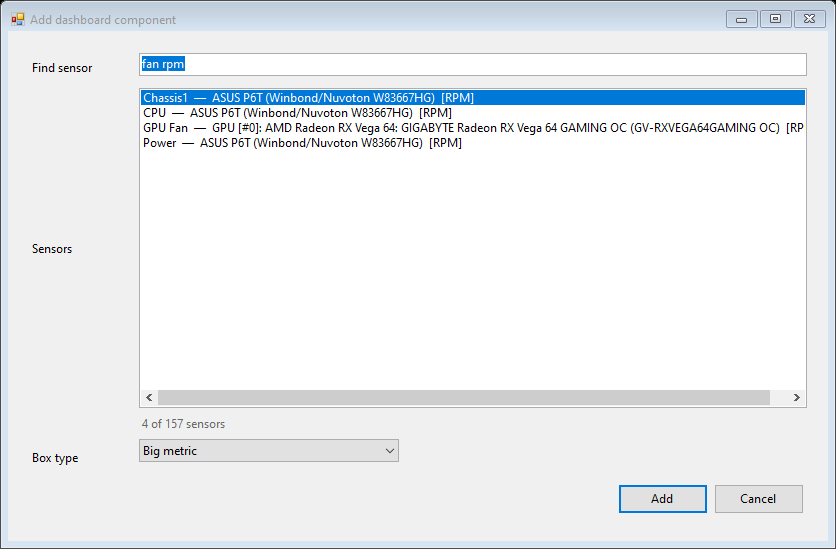
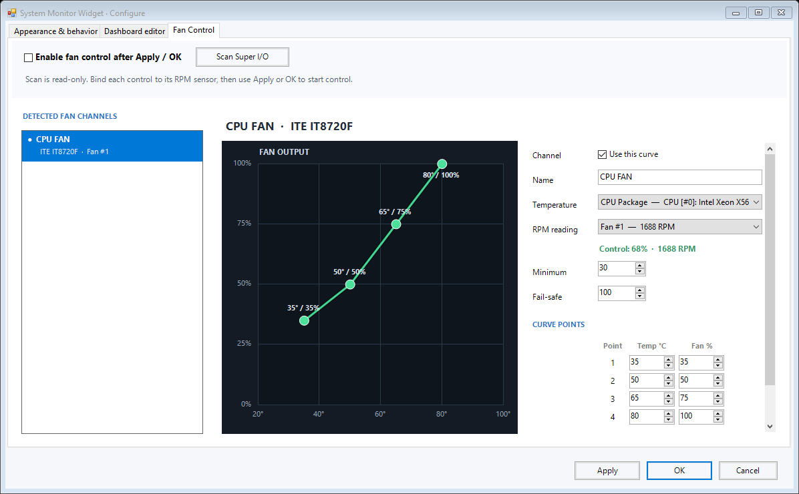

# SystemMonitorWidget

A lightweight, modular Windows desktop hardware monitor powered by HWiNFO shared-memory sensor data. Build separate 3-column and 4-column dashboards, connect any available sensor, and control the presentation of every component.

## Screenshots

| 3-column dashboard | 4-column dashboard |
| --- | --- |
|  |  |






## Features

- Fully configurable 3-column and 4-column dashboards.
- Optional top-three process strip: hide it, rank by CPU, or rank by RAM while showing aggregated CPU and memory usage.
- Editable, version-aware header title with compact Windows system uptime.
- The dashboard is click-through except for a compact gear button that opens the control menu.
- Search and add every sensor exposed through HWiNFO shared memory by label, device, unit, or sensor type.
- Five reusable component types: Big metric, Horizontal spec, Vertical spec, Graph, and Section.
- Drag-and-drop placement with grid snapping and overlap prevention.
- Precise column, half-row, width, and dashboard-height controls.
- Custom display name for every component.
- Per-component value formatting with automatic, 0-, 1-, or 2-decimal precision, unit visibility, a 60–160% value-font control, and a live preview.
- Five colors and four change thresholds, configured independently per component.
- Fixed minimum and maximum for every graph.
- Optional recorded minimum and maximum on Big metric components.
- Duplicate, delete, and reset-layout actions.
- Interface scaling at 100%, 75%, 67%, 50%, 33%, and 25%.
- Always-on-top, opacity, refresh interval, and Start with Windows controls.
- Optional Super I/O fan control with automatic channel detection through the bundled OpenHardwareMonitor library.
- Four-point interactive fan curves bound to any live HWiNFO temperature sensor.
- Each control can be paired with a live Super I/O RPM sensor; matching control/fan indices are paired automatically after scanning.
- Per-channel minimum output and missing-sensor fail-safe output.
- Fan writes run in a separate administrator helper; closing the widget restores each controlled channel to firmware/default mode.
- Apply validates and saves changes without closing Configure; OK applies and closes.
- Existing v1.x dashboard settings are migrated automatically.

## Requirements

- Windows 10 or Windows 11, 64-bit.
- HWiNFO64 with Shared Memory Support enabled.
- .NET Framework 4.x.
- Administrator approval when scanning or enabling Super I/O fan control.

HWiNFO is a separate application and is not bundled with this repository or its releases.

## Dashboard workflow

1. Select the gear button in the header, then choose **Configure dashboard**.
2. Choose the 3-column or 4-column dashboard.
3. Select **Add**, choose a sensor, and choose a component type.
4. Drag the component to a free grid position, or enter its exact position in the inspector.
5. Rename it, set graph bounds if applicable, and configure its five-step color scale.
6. Select **OK** to validate, save, and close the editor.

## Fan-control workflow

1. Keep fan control disabled and select **Scan Super I/O**. The read-only scan discovers control channels and fan RPM sensors.
2. Choose a detected channel, bind its RPM reading, select an HWiNFO temperature source, and edit the four points by dragging the graph or entering exact values.
3. Set a safe minimum and fail-safe output, then enable the channel.
4. Close Open Hardware Monitor before enabling control, because two programs must not write the same controller.
5. Select **Enable fan control after Apply / OK**. Use **Apply** to keep Configure open, or **OK** to apply and close.

## Build from source

Run PowerShell from the repository root:

```powershell
.\build.ps1
```

The build writes the individual binaries plus `artifacts\SystemMonitorWidget-v2.5.0-win-x64.zip` and its SHA-256 checksum.

## Local data

Widget settings stay in the current Windows user's local application-data folder. The repository contains no exported sensor logs, local settings, or user-specific paths.

## Quick start

1. Download `SystemMonitorWidget-v2.5.0-win-x64.zip` from the [latest release](../../releases/latest).
2. Extract all four files into the same folder.
3. Open HWiNFO64 settings and enable **Shared Memory Support**.
4. Start HWiNFO sensors.
5. Run `SystemMonitorWidget-v2.5.0.exe`.
6. Select the header gear and choose **Configure dashboard** to edit the dashboard or configure fan curves.