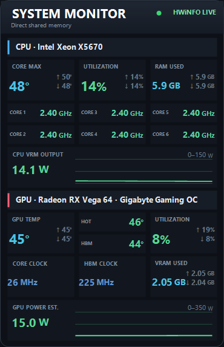
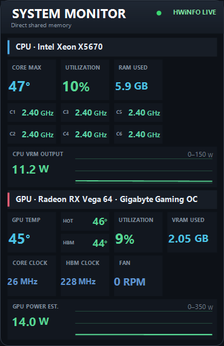
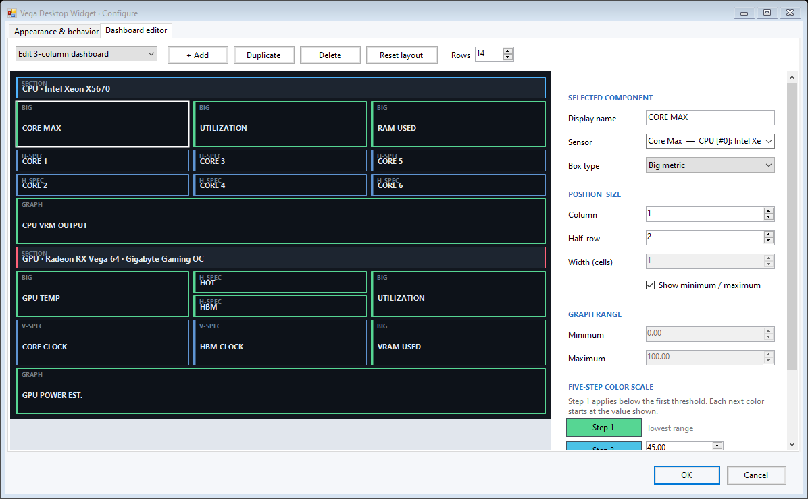

# SystemMonitorWidget

A lightweight, modular Windows desktop hardware monitor powered by HWiNFO shared-memory sensor data. Build separate 3-column and 4-column dashboards, connect any available sensor, and control the presentation of every component.

## Screenshots

| 3-column dashboard | 4-column dashboard |
| --- | --- |
|  |  |



## Features

- Fully configurable 3-column and 4-column dashboards.
- Add any sensor exposed through HWiNFO shared memory.
- Five reusable component types: Big metric, Horizontal spec, Vertical spec, Graph, and Section.
- Drag-and-drop placement with grid snapping and overlap prevention.
- Precise column, half-row, width, and dashboard-height controls.
- Custom display name for every component.
- Five colors and four change thresholds, configured independently per component.
- Fixed minimum and maximum for every graph.
- Optional recorded minimum and maximum on Big metric components.
- Duplicate, delete, and reset-layout actions.
- Interface scaling at 100%, 67%, 50%, 33%, and 25%.
- Always-on-top, opacity, refresh interval, and Start with Windows controls.
- Existing v1.x dashboard settings are migrated automatically.

## Requirements

- Windows 10 or Windows 11, 64-bit.
- HWiNFO64 with Shared Memory Support enabled.
- .NET Framework 4.x.

HWiNFO is a separate application and is not bundled with this repository or its releases.

## Dashboard workflow

1. Open **Configure dashboard** from the widget's right-click menu.
2. Choose the 3-column or 4-column dashboard.
3. Select **Add**, choose a sensor, and choose a component type.
4. Drag the component to a free grid position, or enter its exact position in the inspector.
5. Rename it, set graph bounds if applicable, and configure its five-step color scale.
6. Select **OK** to validate, save, and close the editor.

## Build from source

Run PowerShell from the repository root:

```powershell
.\build.ps1
```

The compiled executable is written to `artifacts\SystemMonitorWidget-v2.0.exe`.

## Local data

Widget settings stay in the current Windows user's local application-data folder. The repository contains no exported sensor logs, local settings, or user-specific paths.

## Quick start

1. Download `SystemMonitorWidget-v2.0.exe` from the [latest release](../../releases/latest).
2. Open HWiNFO64 settings and enable **Shared Memory Support**.
3. Start HWiNFO sensors.
4. Run `SystemMonitorWidget-v2.0.exe`.
5. Right-click the widget and choose **Configure dashboard** to add sensors, select component types, arrange the grid, and customize colors.
